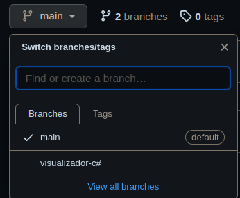

# Código fuente - Treap (C++)

## Integrantes
- Alejandro Oré
- José Tipula
- Valeria Valdez

## Código fuente (C++)

Este es el código original del cual se basó el código de C# utilizado en el visualizador. Este está programado enteramente en C++ y contiene algunos métodos útiles y bien ordenados para la visualización del Treap en el terminal de ejecución.

Nota: La impresión del Treap está volteada 90 grados.

(Imagen volteada 90°)

## Visualizador

Este branch (main) solo contiene el Treap implementado en C++. Si se busca el código del visualizador, véase el branch 'visualizador-c#'. En el mismo README de dicho branch se podrá encontrar instrucciones de uso.

